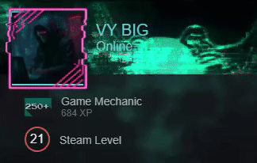

<h1 align="center">Привет! Меня зовут Василий aka VYBIG👋🏻</h1>
<h3 align="center">Разработчик ПО в <a href="https://astralinux.ru" target="_blank">Русбитех-Астра</h3>

## Связь со мной:

<!--## Донаты

<!--
**VYBIG/VYBIG** is a ✨ _special_ ✨ repository because its `README.md` (this file) appears on your GitHub profile.
Here are some ideas to get you started:
- 🔭 I’m currently working on ...
- 🌱 I’m currently learning ...
- 👯 I’m looking to collaborate on ...
- 🤔 I’m looking for help with ...
- 💬 Ask me about ...
- 📫 How to reach me: ...
- 😄 Pronouns: ...
- ⚡ Fun fact: ...
-->
## Статистика

  

&nbsp;

